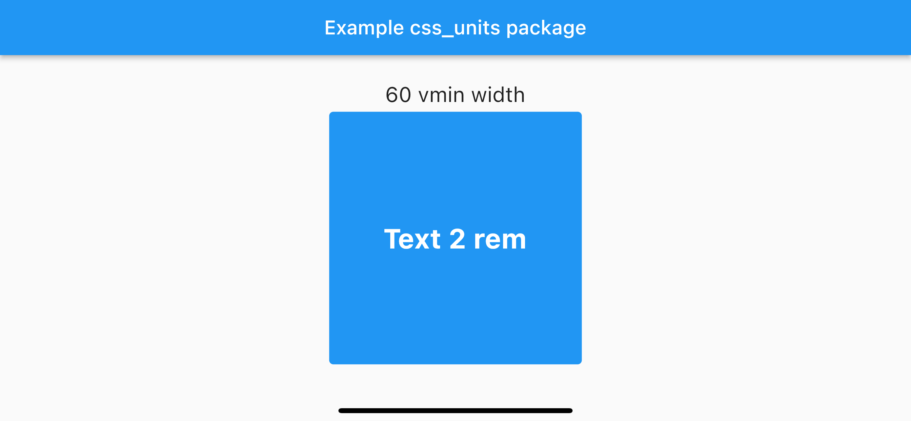

# CSS Units

Добавляем конвертер для [CSS Viewport Units](https://learn.javascript.ru/css-units#otnositelno-ekrana-vw-vh-vmin-vmax) - `vmin`, `vmax`, `vw`, `vh`, `rem`.

Удобная обертка чтобы задавать размеры относительно экрана
или BoxConstraints LayoutBuilder`а

## Идея

Идея в том чтобы добавить относительные размеры из CSS Units 3 spec.
Сделать это без функций и классов, просто расширяя стандартный `double`:

- `42.vmin` - 42% **наименьшей** стороны экрана в logical pixels (double)
- `42.vmax` - 42% **наибольшей** стороны экрана в logical pixels (double)
- `42.vw` - 42% **ширины** экрана в logical pixels (double)
- `42.vh` - 42% **высоты** экрана в logical pixels (double)
- `3.rem` - 42 - три высоты **размера шрифта** по умолчанию (если не меняли `14.0 * 3`) в logical pixels (double)

Плюсом добавлен еще процент:

- `42.pc` - 42%, то есть число 0.42  (double)

Вдохновился идеями из пакета [dimension](https://pub.dev/packages/dimension)

## Особенности

Читабельность!

Смотрите как красиво и понятно задавать относительные размеры: `width: 4.vmax`

## Установка

Добавьте в `pubspec.yaml` (не забудьте запустить pub get):

```yaml
dependencies:
  css_units:
    git:
      url: https://github.com/dmitrymaslovhome/css_units
```

## Использование

Внимание! Перед использованием относительных размеров нужно всегда вызывать
`CssViewportUnits.initContextSizes(context);`

Инициализацию размеров (опять же, непосредственно в том контексте,
где используте относительные размеры) также можно задавать через:

- `CssViewportUnits.initConstraintsSize(final BoxConstraints constraints)` - задать размеры относительно BoxConstraints LayoutBuilder`а
- `CssViewportUnits.initCustomSize(final Size size)` - задать кастомный размер *экрана*
- `CssViewportUnits.initDefaultFontSize(final double fontSize)` - задать кастомный размер шрифта по умолчанию

Внимание! Вызывайте их непосредственно в том контексте, где используте относительные размеры.
Нужно понимать, что размеры высчитываются динамически. Это значит что если вы задаете
их в одном виджете, а используете в других, то они не перестроятся сами по себе при изменении.

Например, зададим размеры `60 vmin` у контейнера:

```dart
@override
Widget build(BuildContext context) {
  CssViewportUnits.initContextSizes(context);
  return Container(
    width: 60.vmin, // cellSize
    height: 60.vmin, // cellSize
    margin: EdgeInsets.all(1.vmin), // cellGap
    decoration: BoxDecoration(
      color: Colors.blue,
      borderRadius: BorderRadius.circular(1.vmin), // borderRadius
    ),
  );
}
```



Если все размеры складываете в отдельный файл ресурсов, для получения
значений используйте геттеры (чтобы размеры вычислялись динамически при запросе)
и вынесете туда инициализацию размеров контекста и вызывайте уже его перед использованием.

Например, вынесем размеры в `resources/app_sizes.dart`:

```dart
class AppSizes {
  static initContextSizes(BuildContext context) {
    CssViewportUnits.initContextSizes(context);
  }

  static get cellSize => 60.vmin;
  static get cellGap => 1.vmin;
  static get borderRadius => 1.vmin;
  static get fontSize => 7.5.vmin;
}
```
